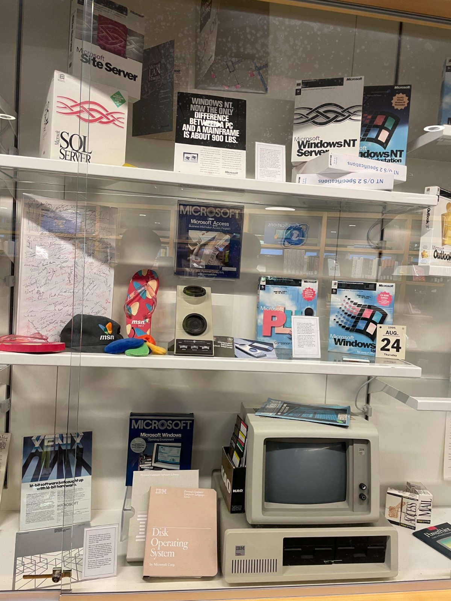

## Overview

From April 16 to 18, I had the opportunity to attend the Embedded Open Source Summit (EOSS) in Seattle, hosted by the Linux Foundation. I presented a project I’ve been working on related to UAV system integration. EOSS was held alongside the Open Source Summit North America (OSSNA) and the Linux Security Summit North America (LSSNA), offering a great chance to learn from great developers in the open source community.

Beyond the conference itself, we also took time to visit UC Berkeley, the University of Washington, and Microsoft's headquarter.

<iframe src="https://drive.google.com/file/d/1aXPNn7SbN5oBkVzIqHo13JiRVv_63CJi/preview" width="100%" height="500px"></iframe>

## Scenes from the event

Seattle Convention Center entrance:

Keynote room:

A talk on Linux network driver development:

Exhibition hall featuring the latest tech:

Evening banquet:

## University of California, Berkeley 

On our way to Seattle, we had a long layover in San Francisco, so we took the chance to visit UC Berkeley. It's a place I’ve always wanted to visit because of its strong open source and hacker culture. It’s also the birthplace of the BSD operating system.

Coincidentally, the day we visited was **Cal Day**, Berkeley’s annual open campus event, which made the experience even more special.

Sather Gate:

Sather Tower:

View from the top of the tower:

Cal Day band performance:

Student orientation in the auditorium:

## University of Washington

We visited the University of Washington during a break in the summit. Since it’s close to Microsoft’s HQ, both Bill Gates and Paul Allen have donated buildings to the university. We were shown around by a few student friends, short but memorable.

Suzzallo Library exterior:

Inside Suzzallo Library:

Stained glass windows:

Bill & Melinda Gates Center:

Electrical & Computer Engineering Building (donated by Paul Allen):

## Microsoft HQ

A friend working at Microsoft kindly gave us a tour of the campuses in Redmond and Bellevue, which together include over 100 buildings. It’s a vast and impressive place.

Due to restrictions, we couldn’t take photos inside workspaces, but we did capture public areas like Building 92 (the Visitor Center), lounges, and some historical exhibits.

Building 92 - Visitor Center:

Staff lounge and relaxation areas:

Some classic items displayed in the Microsoft visiting center:

