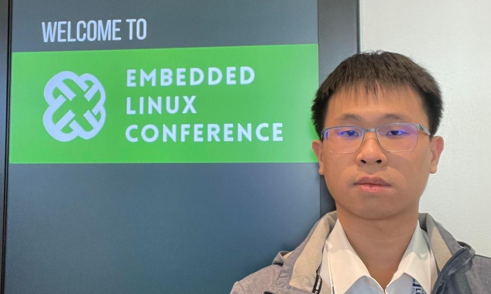

## Overview

4/16至4/18期間在成大黃敬群教授指導及爭取下，我們在 Linux Foundation 主辦的 Embedded Open Source Summit (EOSS) 中發表了在台大休學前針對無人機系統整合的題目。同時，EOSS 也與 Open Source Summit North Ameraica (OSSNA) 及 Linux Security Summit North America (LSSNA) 合辦，可以接觸到許多第一手的 Open Source 軟體資訊。以下針對本次活動亮點進行紀錄。

除了研討會外，我們亦參訪了加州柏克萊大學 (UC Berkeley), 華盛頓大學 (University of Washington), 以及位於西雅圖東岸的 Microsoft 總部。

[EOSS 2024 照片集](https://flickr.com/photos/linuxfoundation/albums/72177720315875018/)
[OSSNA 2024 照片集](https://flickr.com/photos/linuxfoundation/albums/72177720315883609/)

## Event Day 1 (4/16)

4/16 在我個人的議程，主題是利用 Open Source 方案打造無人機相機與雲台控制程式，在這過程中我們注意到了既有方案存在可改進空間。

關於此演講的資訊可見: [Link](https://static.sched.com/hosted_files/eoss24/df/Crafting%20a%20Vision-Aided%20Software%20Stack%20for%20UAV.pdf?fbclid=IwZXh0bgNhZW0CMTAAAR2xjccqOi2Xi-bsG5J97rWtu2C9Y76W0BGVjKnSIXQernR7G4iUo9nNumw_aem_AU4iiYibTMCYSvaH_4f4GNIXwJV2pZ1I0N9NxLdhlv7wEm7QG6lMZr2ge7cpmM5qdhSTYyTlkO3qsdr1q6nqXqz5)

---

4/16 於 Embedded Open Source Summit 2024，來自Linaro 的 Fabian Parent 發表了 From C to Rust: Bringing Rust Abstractions to Embedded Linux  的題目。

在此演講中，講者對 Linux Kernel採納 Rust 作為第二種開發語言進行了說明，大致包含:
* C語言語法在過去 50年幾乎沒有改變, Rust 是相對新的程式語言 (約10年)
* Rust 包含了 Ownership 以及 Borrowing 的概念
* Rust 強迫使用者進行 Error handling
* Rust 有足夠的 Efficient
* Rust 是記憶體安全的 (且編譯器可以檢查記憶體存取、Concurrency 等問題)

目前在 Linux kernel 中:
* Rust 僅用作 Device driver 的撰寫
* Rust 的支援仍被視為實驗性的

但同時，Rust 在 Linux kernel 中有如下的隱患:
* 增加維護的複雜度，開發者需要熟悉兩種程式語言 (Rust 有較陡峭的學習曲線)
* Rust 的軟體抽象化 (Abstration Layer) 可能帶來新的錯誤 (Bugs)

根據演講，目前有許多 Device driver 正在以 Rust重新撰寫, 包含 Clock, Regulator, DMA, GPIO, IRQ, Reset, I2C等，且平台上 x86-64 完整度較高，這或許會帶來新的貢獻機會。

關於此演講的資訊可見: [Link](https://eoss24.sched.com/event/533529f5054fc8f60dde43ea3d9195e9?fbclid=IwZXh0bgNhZW0CMTAAAR2jkgtDq3C8hIDDuCajV7__KJUXylb5KBjOUg_M1LNhgWfz5NW2LPUsLy4_aem_AU7BV2jXhY2F4VfLlxbJjp7Obnifw_UXNKJTlDlrKvK9dmCX3na35wtyj_aR3QDjzBlWh7Cs-IK9Ho8W2FcjjlzP)

## Event Day 2 (4/17)

4/17 在 Open Source Summit North America 2024, 來自 igalia 的的 Changwoo Ming 發表了 Optimizing Scheduler for Linux Gaming 的演講。

此演講分析了遊戲環境下 Linux task 的 Workload 性質，提出可透過 Task Latency 作為基準進行排程以提升遊戲性能。講者隨後以 sched_ext (基於 BPF 的排程器開發框架) 設計了名為 Latency-criticality Aware Virtual Deadline (LAVD) 的排程演算法。根據數據顯示，LAVD 相較於 EEVDF (Earliest Eligible Virtual Deadline First) 可達 7 FPS 的楨率提升，且波
動幅度較小。

關於此演講的資訊可見: [Link](https://ossna2024.sched.com/event/07a5bb414c14ddacb573c147ba5f3435?fbclid=IwZXh0bgNhZW0CMTAAAR28j12-uPZPglxawfGJy68Tu8Y5-Ec2YAcYJdlfvFoYxEH9DreRD1f6vJA_aem_AU6oCVme9VNDTvGZ_OAVN_y29gBTXIPuImQfRJBGGYdGNyRfbAB_3MY8nRJV055YSwkPUjmLi1HV8PdlLxmkS0a7)

---

4/17 在 Embedded Open Source Summit 2024, 來自 Linutronix GmbH 的 Sebastian S. Siewior 在演講中針對 PREEMPT_RT (Linux 原生 Real-time 支援) 在 Mainline 的引入給予了開發指引以及概要說明。

關於此演講的資訊可見: [Link](https://eoss24.sched.com/event/c48d0e5f7a0f462361e09c89c966c9f4?fbclid=IwZXh0bgNhZW0CMTAAAR28j12-uPZPglxawfGJy68Tu8Y5-Ec2YAcYJdlfvFoYxEH9DreRD1f6vJA_aem_AU6oCVme9VNDTvGZ_OAVN_y29gBTXIPuImQfRJBGGYdGNyRfbAB_3MY8nRJV055YSwkPUjmLi1HV8PdlLxmkS0a7)

---

4/17 在 Open Source Summit North America 2024，來自 IBM 的 Sahdev Zala 發表了 Get to Know PyTorch - A Cutting Edge Open Source AI Framework for Deep Learning 的演講。

此演講介紹了 Pytorch 的 Data loader, Model training, Validation, Distributed training, Model compilation 以及其他議題，適合深度學習的初學者和觀望者一窺目前最流行的深度學習框架 PyTorch 的基本概念。

關於此演講的資訊可見: [Link](https://ossna2024.sched.com/event/8a4c262031e7087756fcb68d34034ab1?fbclid=IwZXh0bgNhZW0CMTAAAR1Xv0hFGpUvgO6ubhI01ufwQloZ3CoYwLb2_qMQP3m4OOJKlUDwQq46cBc_aem_AU58NYSlAWVBjtR1hFzSfuagc9FpPqpzgzjGN_wpPGQJx06ZGFhjbmZFAYoqx2M0MEQ2PbTRFaYljnVz4VkKkVjW)

## Event Day 3 (4/18)

4/18 在 Linux Security Summit North America 2024, 來自Google 的 Kees Cooks 發表了 Mitigating Integer Overflow in C 的題目。

此演講中講者指出 Arithmetic overflow 已造成了許多安全性問題，且由於 C語言的特性難以完全避免。為了應對此問題，講者介紹了一些技巧，包含 Wrap-around、Saturate (refcount_t)、Trap 和 Design pattern 等。除此之外對於 Sanitizer 的使用和Undefined behavior 的處理也進行了介紹。

在演講的最後，講者指出 Linux kernel 仍有許多 Integer arithmetic 程式碼仍待重構 (Refactoring)，這提供許多潛在的貢獻機會。

關於此演講的資訊可見: [Link](https://lssna24.sched.com/event/c0379cb10e7891ddb030e0aa3282052c?iframe=no&fbclid=IwZXh0bgNhZW0CMTAAAR2fnqAaNgd-22EK4-NORdEk36h8hx-9dqOdLEsme2hbc3W2dm8E7jk5KaA_aem_AU6D5QTcJnrRwynarbBmOZdGBXQ0_cZWU6AS7zdejLTeCDLmqcUSdWc7aofqhSrcOZNQvyBJqGJAPVbnvhabkpB_)

---

4/18 於 Linux Security Summit North America 2024, 來自 Microsoft 的 Anna Trikalinou 以及 Thara Gopinath 發表了 Linux Virtualization Based Security (LVBS) 的題目。

在此演講中，講者使用了 Hyper-V (Hypervisor) 在虛擬環境中執行作業系統(Linux)以達到安全保護 (Virtual Secure Mode, VSM)。相較於在 Bootloader 層次進行 Secure  Protection (即在 OS 執行前確認Image 沒有被篡改過)，使用 VSM 具有較佳的 Scalability (可同時執行多個作業系統)。同時，VSM 也會利用硬體所支援的虛擬化技術達到較佳的性能。
演講中也引入 Virtual Trust Level (VTL) 的概念，且在不同等級會有對應的安全性。舉例來說 VTL1 相較 VTL0 會對 Guest OS 和 Bootloader 產生 Signature (憑證)，並以此保證 Secure OS 的 Integrity。(即 VTL0 為普通 Guest OS, 而 VTL1 是 Secure OS)。

講者也提到了 Memory Protection 的機制，這是由 Hypervisor 所提供的功能，在被稱為Hypervisor-Enforced Kernel Integrity (HEKI) 的框架下，可以透過設定 Read-Write-Execute 的權限達到安全保護 (Hyper-V 和 KVM 皆有)。
最後，講者也有提到未來的工作項目包含 Module Authentication、Trustlets 以及 Confidential Computing，在可見的未來安全性應該會是 Linux Kernel 發展的重點之一。

註: 此演講的重點在於 Kernel 中引入虛擬化保護機制，而不是單單利用 Hypervisor

關於此演講的資訊可見: [Link](https://lssna24.sched.com/event/c4edcf551ac7853b119a8cc6fbf355b8?iframe=no&fbclid=IwZXh0bgNhZW0CMTAAAR3CFfJ-3NTh2exC2Ck2D7VpNj-4vjApKtkcWeIa2UwwkedLoq47sQYch_k_aem_AU48r72rwJGy7qtEb9XIIWV0H_L8lqX6CHj_-hyYAcQ7Eeqqc4s0l4K8pN8fFRPxpWG99F25D2pFpr1413nkHXUI)

---

## 會議期間剪影

Seatle Convention Center 會議中心入口:

Keynote 會議室:

我與 Embedded Linux Conference 的合照，我的議程於此 Session 發表:

同行學弟的照片，碩一上便至如此大型的研討會發表 Linux Kernel 的開發心得:

議程剪影:

廠商展示間，有許多最新技術的火力展示:

會後全體聚餐，西雅圖的晚上七點仍是一片明亮:

結識台灣籍至會議上發表的 Linux Kernel 開發者:

## UC Berkeley 參訪

由於我們是在舊金山轉機且中間有超過半天空檔，因此利用空檔至加州柏克萊大學參訪。想參觀的主要原因是加州柏克萊大學有知名的 Open Source 及黑客文化，其中最有代表性的便是 BSD 作業系統。

加州大學校牌，作為加州最知名的大學系統，加州大學一共有 10 所分校:

與加州柏克萊大學校門合影，後方有巴勒斯坦學生示威，抗議以色列的入侵:

加州柏克萊大學鐘樓:

從鐘樓上往下俯瞰之加州柏克萊大學校園景色:

加州柏克萊大學新生日活動:

新生日學生說明會，位於大禮堂:

## University of Washington 參訪

華盛頓大學位於西雅圖，且由於微軟總部設於附近，因此兩位共同創辦人皆曾捐贈大樓給華大。我們藉由會議空檔至華大參訪，且結識四位華大學生的新朋友。

Suzzallo 圖書館:

Suzzallo 圖書館內部:

Suzzallo 圖書館窗戶:

Bill Gates 捐贈之電腦科學系館

Paul Allen 捐贈之電機與資訊系館:

## Microsoft 總部參訪

Microsoft 總部位於 西雅圖東岸的 Redmond 及 Bellevue, 共計約有百座辦公大樓。應任職於 Microsoft 的朋友邀約下我們得以參觀部分區域，由於工作區域禁止攝影，僅展示公共區域照片。

Microsoft Building 92 (主要是 Visiting Center):

與 Microsoft Logo 合影

員工休息室:

展示之歷史文物:

