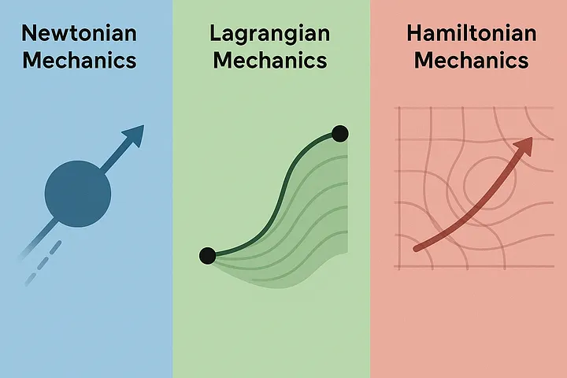
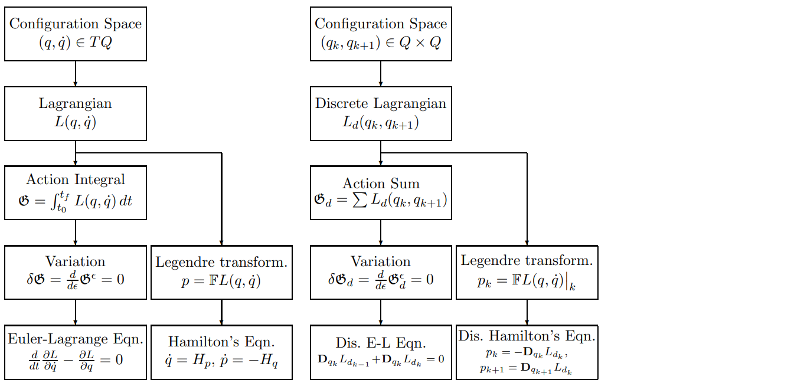

Source: An Introduction to Hamiltonian and Lagrangian Methods for Economists

## 1. Introduction

Rigid-body motion is different from motion in an ordinary vector space. A position can be represented by a vector, but an attitude must remain a valid rotation matrix. If a numerical method ignores this geometry, the computed attitude can gradually lose orthogonality and stop representing a physical rotation.

A Lie Group Variational Integrator (LGVI) addresses two issues at the same time. The Lie group update keeps the configuration on spaces such as $SO(3)$ or $SE(3)$, while the discrete variational principle preserves the mechanical structure responsible for good long-time behavior.

### 1.1 Motivation

Let $R(t)$ describe the attitude of a rigid body. It maps vectors written in the body-fixed frame to the inertial frame. A valid attitude belongs to $SO(3)$, so its columns remain orthonormal and its determinant is one.

$R(t) \in SO(3)$

$R^T R = I, \qquad \det R = 1$

$\dot{R} = R\hat{\Omega}$

Here $\Omega\in\mathbb{R}^3$ is the angular velocity expressed in the body-fixed frame. The hat map turns it into a skew-symmetric matrix, so $R\hat\Omega$ is a valid instantaneous direction of motion on $SO(3)$.

A direct forward-Euler step treats the entries of $R$ as unrelated scalar variables:

$R_{k+1} = R_k + hR_k\hat{\Omega}_k$

$R_{k+1}^T R_{k+1} \neq I$

The error may be small in one step, but it accumulates. The resulting matrix eventually contains artificial stretching or shearing in addition to rotation. This is the first problem that a Lie group update is designed to avoid.

### 1.2 Structure-Preserving Integration

A numerical integrator defines a discrete flow map $\Phi_h$ that advances the state by a time step $h$:

$\Phi_h : z_k \mapsto z_{k+1}$

For mechanical systems, accuracy at a single time step is not the only concern. The update should also respect the geometric structures that organize the exact dynamics.

$\Phi_h^*\omega = \omega$

$J_d(z_{k+1}) = J_d(z_k)$

$g_k \in G \Rightarrow g_{k+1} \in G$

These statements describe three different properties. The first preserves the symplectic form, the second preserves a discrete momentum when the system has the corresponding symmetry, and the third keeps the configuration on its Lie group. Together they usually give more reliable long-time motion than repeatedly correcting an unconstrained numerical solution.

### 1.3 Why Lie Group Integrators?

Suppose the configuration $g(t)$ belongs to a Lie group $G$. Instead of differentiating its matrix entries independently, we describe its velocity by an element $\xi$ of the Lie algebra $\mathfrak g$:

$g(t) \in G$

$\xi = g^{-1}\dot{g} \in \mathfrak{g}$

$\dot{g} = g\xi$

The continuous motion is replaced by a sequence of group increments $F_k$:

$g_{k+1} = g_kF_k, \qquad F_k \in G$

$F_k \approx \exp(h\xi_k)$

Since a product of group elements is still in the group, the update is geometrically valid by construction. For a rotation, $F_k$ is the relative rotation during one time step rather than an additive change to the entries of $R_k$.

For more information, please refer to
- [Lie Group Variational Integrators for the Full Body Problem](https://arxiv.org/pdf/math/0508365)
- [Computational Geometric Optimal Control of Rigid Bodies](https://arxiv.org/pdf/0805.0639)

## 2. Differential Geometry

Differential geometry extends calculus from flat vector spaces to curved spaces. Only a small part of it is needed here: manifolds describe where a configuration can live, tangent vectors describe how it can move, and differential forms describe the mechanical structures that should be preserved.

### 2.1 Manifolds

A manifold is a space that may be curved globally but looks like an ordinary Euclidean space when viewed locally. A sphere is a familiar example. The rotation group $SO(3)$ is another manifold, although it is represented by $3\times3$ matrices rather than points in three-dimensional space.

The key idea is that a configuration should be treated as a point on its manifold, not as an arbitrary collection of coordinates.

### 2.2 Tangent Spaces

The tangent space $T_qM$ contains all instantaneous directions in which one can move from a point $q$ while remaining on the manifold. It plays the role of the local vector space attached to $q$.

$T_qM$

One way to construct a tangent vector is to draw a smooth curve $\gamma$ on the manifold through $q$ and differentiate it at that point:

$\gamma(0)=q$

$v = \dot{\gamma}(0) \in T_qM$

For example, an attitude is a point $R\in SO(3)$, while its instantaneous rotational velocity belongs to $T_RSO(3)$.

### 2.3 Cotangent Spaces

The cotangent space $T_q^*M$ is the dual of the tangent space. Its elements are linear rules that take a tangent vector and return a scalar.

$T_q^*M = (T_qM)^*$

$\alpha \in T_q^*M$

$\langle \alpha,v\rangle \in \mathbb{R}, \qquad v\in T_qM$

In mechanics, velocities are tangent vectors, while momenta and forces are naturally cotangent vectors. The pairing $\langle\alpha,v\rangle$ can be interpreted as evaluating momentum on a velocity or force on a virtual displacement.

### 2.4 Vector Fields and Flows

A vector field assigns a tangent vector to every point of the manifold. It is the geometric version of an ordinary differential equation: at each state, it specifies the direction in which the state should move.

$X(q) \in T_qM$

Starting from $q$, the flow $\Phi_t(q)$ follows these directions through time:

$\frac{d}{dt}\Phi_t(q)=X(\Phi_t(q))$

$\Phi_0(q)=q$

### 2.5 Differential Forms

A differential one-form consumes one tangent vector, while a differential two-form consumes two tangent vectors. These objects can be defined independently of a particular coordinate system.

$\alpha_q : T_qM \rightarrow \mathbb{R}$

$\omega_q : T_qM \times T_qM \rightarrow \mathbb{R}$

$\omega_q(u,v)=-\omega_q(v,u)$

The antisymmetry of a two-form means that exchanging its two inputs changes the sign. The symplectic structure used in Hamiltonian mechanics is a special differential two-form.

### 2.6 Pullbacks

A map $\Phi:M\rightarrow N$ moves points from one manifold to another. The pullback $\Phi^*\omega$ brings a form on $N$ back to $M$, allowing the form before and after the map to be compared.

$\Phi : M \rightarrow N$

$(\Phi^*\omega)_q(u,v)=\omega_{\Phi(q)}(D\Phi_q\,u,D\Phi_q\,v)$

This notation is important because a flow is called symplectic precisely when pulling the symplectic form back through the flow leaves it unchanged.

### 2.7 Symplectic Forms

In canonical position-momentum coordinates $(q,p)$, the standard symplectic form is

$\omega=\sum_{i=1}^{n}dq^i\wedge dp_i$

The wedge $\wedge$ denotes an antisymmetric product, so exchanging its two factors changes the sign.

It is closed,

$d\omega=0$

and nondegenerate:

$\omega(u,v)=0 \ \forall v \Rightarrow u=0$

Together, these properties make $\omega$ a symplectic form. A map preserves the Hamiltonian geometry when

$\Phi^*\omega=\omega$

This does not mean that every distance or every state component is preserved. It means that the position-momentum geometry underlying Hamiltonian motion is preserved.

## 3. Geometric Mechanics

Geometric mechanics expresses classical mechanics using manifolds and their tangent and cotangent spaces. The Lagrangian viewpoint starts from configurations and velocities; the Hamiltonian viewpoint starts from configurations and momenta. They describe the same regular mechanical system from two complementary perspectives.

### 3.1 Configuration and Phase Spaces

$Q$ denotes the configuration space. A point $q$ specifies where the system is, without specifying how it is moving.

$q\in Q$

Adding a velocity gives a point in the tangent bundle $TQ$, while adding a momentum gives a point in the cotangent bundle $T^*Q$:

$(q,\dot{q})\in TQ$

$(q,p)\in T^*Q$

### 3.2 Lagrangian Mechanics

The Lagrangian is a scalar function of configuration and velocity:

$L:TQ\rightarrow\mathbb{R}$

$L(q,\dot{q})=T(q,\dot{q})-V(q)$

For a standard mechanical system, it is kinetic energy minus potential energy. Differentiating it with respect to velocity defines the conjugate momentum:

$p=\frac{\partial L}{\partial \dot{q}}$

### 3.3 Hamilton’s Principle

Hamilton's principle does not directly prescribe the acceleration. Instead, it considers every admissible path between fixed endpoints and selects the path for which the action is stationary.

$S[q]=\int_{t_0}^{t_1}L(q,\dot{q})\,dt$

$\delta S=0$

$\delta q(t_0)=\delta q(t_1)=0$

Here $\delta q$ is an infinitesimal change of the entire path, not a time derivative. The endpoint variations vanish because the initial and final configurations are held fixed during the comparison.

### 3.4 Euler–Lagrange Equations

Applying Hamilton's principle and integrating the velocity variation by parts produces the Euler--Lagrange equations:

$\frac{d}{dt}\frac{\partial L}{\partial \dot{q}}-\frac{\partial L}{\partial q}=0$

For ordinary particles, these equations reduce to Newton's law. Their variational origin is important because the discrete version of the same argument leads to variational integrators.

### 3.5 Legendre Transform

The Legendre transform replaces velocity by momentum. First compute

$p=\frac{\partial L}{\partial \dot{q}}$

and, when this relation can be inverted to obtain $\dot q$ from $(q,p)$, define the Hamiltonian

$H(q,p)=p^T\dot{q}-L(q,\dot{q})$

$\mathbb{F}L:TQ\rightarrow T^*Q$

For standard mechanical systems, $H$ is usually the total energy $T+V$.

### 3.6 Hamiltonian Mechanics

Hamiltonian mechanics evolves position and momentum together:

$\dot{q}=\frac{\partial H}{\partial p}$

$\dot{p}=-\frac{\partial H}{\partial q}$

$z=\begin{bmatrix}q\\p\end{bmatrix}$

$\dot{z}=J\nabla H(z)$

$J=\begin{bmatrix}0&I\\-I&0\end{bmatrix}$

The matrix $J$ in this subsection is the canonical symplectic matrix. It is unrelated to the rigid-body inertia matrix that will also be denoted by $J$ in Section 8.

### 3.7 Symplectic Flows

The exact flow of a Hamiltonian system preserves the symplectic form:

$\Phi_t:T^*Q\rightarrow T^*Q$

$\Phi_t^*\omega=\omega$

$(D\Phi_t)^T J(D\Phi_t)=J$

The matrix identity is the canonical-coordinate version of $\Phi_t^*\omega=\omega$. A symplectic numerical integrator reproduces this structural property in discrete time, which is why its long-time energy behavior is often better than that of a generic integrator.

### 3.8 Symmetry and Noether’s Theorem

A symmetry is a transformation that changes the description of a motion without changing the Lagrangian. If a group action $\Phi_g$ is a symmetry,

$L(\Phi_g(q),T\Phi_g(\dot{q}))=L(q,\dot{q})$

then Noether's theorem associates it with a conserved momentum:

$\frac{d}{dt}J(q,p)=0$

Here $J(q,p)$ denotes a momentum map, not the symplectic matrix or the inertia matrix used elsewhere. For example, invariance under translation gives conservation of linear momentum, while invariance under rotation gives conservation of angular momentum.

## 4. Lie Groups and Lie Algebras

Lie groups provide a natural language for configurations that can be composed. Two rotations can be multiplied to obtain another rotation, and every rotation has an inverse. The associated Lie algebra is a linear space that describes infinitesimal motion near the identity, where ordinary calculus is easier to use.

### 4.1 Lie Groups and Lie Algebras

A Lie group is simultaneously a smooth manifold and a group, with smooth multiplication and inversion. This combines geometry with an algebraic rule for composing configurations.

$G \text{ is a smooth manifold and a group}$

The symbol $e$ denotes the identity element. The tangent space at the identity is called the Lie algebra:

$\mathfrak{g}=T_eG$

$\xi\in\mathfrak{g}$

Although $G$ may be curved, $\mathfrak g$ is a vector space. This lets us describe local velocities with vectors or matrices while keeping the actual configuration on the group.

### 4.2 SO(3) and SE(3)

$SO(3)$ is the group of three-dimensional rotations. The condition $R^TR=I$ preserves lengths and angles, while $\det R=1$ excludes reflections.

$SO(3)=\{R\in\mathbb{R}^{3\times3}\mid R^TR=I,\det R=1\}$

$\mathfrak{so}(3)$ is its Lie algebra, consisting of skew-symmetric matrices:

$\mathfrak{so}(3)=\{\hat{\Omega}\in\mathbb{R}^{3\times3}\mid \hat{\Omega}^T=-\hat{\Omega}\}$

$SE(3)$ combines an attitude $R$ and a position $x$. It represents the full pose of a rigid body:

$SE(3)=\left\{\begin{bmatrix}R&x\\0&1\end{bmatrix}\mid R\in SO(3),x\in\mathbb{R}^3\right\}$

$\mathfrak{se}(3)=\left\{\begin{bmatrix}\hat{\Omega}&v\\0&0\end{bmatrix}\right\}$

Thus, an element of $\mathfrak{se}(3)$ combines an infinitesimal rotation $\hat\Omega$ and an infinitesimal translation $v$.

### 4.3 Lie Brackets

The Lie bracket measures the noncommutativity of infinitesimal group motions. For matrix Lie groups, it is the matrix commutator:

$[\xi,\eta]=\xi\eta-\eta\xi$

In three-dimensional rotation, the hat and vee maps identify vectors in $\mathbb R^3$ with skew-symmetric matrices in $\mathfrak{so}(3)$:

$(\cdot)^\wedge:\mathbb R^3\rightarrow\mathfrak{so}(3), \qquad (\cdot)^\vee:\mathfrak{so}(3)\rightarrow\mathbb R^3$

$x=\begin{bmatrix}x_1\\x_2\\x_3\end{bmatrix}, \qquad \hat{x}=x^\wedge=\begin{bmatrix}0&-x_3&x_2\\x_3&0&-x_1\\-x_2&x_1&0\end{bmatrix}, \qquad (\hat{x})^\vee=x$

The hat map satisfies $\hat a b=a\times b$. Under this identification,

$[\hat{a},\hat{b}]=\widehat{a\times b}$

This relation is why cross products appear naturally in rigid-body equations.

### 4.4 Exponential and Logarithm Maps

The exponential map converts an element of the Lie algebra into a finite group motion. The logarithm performs the local reverse operation:

$\exp:\mathfrak{g}\rightarrow G$

$\log:G\rightarrow\mathfrak{g}$

$R=\exp(\hat{\theta})$

$\hat{\theta}=\log(R)$

For $SO(3)$, the vector $\theta$ points along the rotation axis and its norm gives the rotation angle. Near the identity, $\exp(\hat\theta)$ is the geometrically correct analogue of adding a small rotation vector.

### 4.5 Left and Right Translations

Group multiplication moves tangent information from one point of the group to another. Multiplication by a fixed element $g$ from the left or right defines

$L_g(h)=gh$

$R_g(h)=hg$

In these two definitions, $h$ is another group element; it is unrelated to the time step denoted by $h$ in the numerical method.

$T_hL_g:T_hG\rightarrow T_{gh}G$

$T_hR_g:T_hG\rightarrow T_{hg}G$

The maps $T_hL_g$ and $T_hR_g$ are their derivatives. They transport tangent vectors and are used to express velocities and variations in a common vector space.

### 4.6 Adjoint and Coadjoint Actions

The adjoint action describes how the same Lie-algebra motion changes when transported by a group element:

$\operatorname{Ad}_g\xi=g\xi g^{-1}$

The coadjoint action is the corresponding transformation for dual quantities such as momentum:

$\langle \operatorname{Ad}_g^*\mu,\xi\rangle=\langle\mu,\operatorname{Ad}_g\xi\rangle$

Their infinitesimal versions are

$\operatorname{ad}_\xi\eta=[\xi,\eta]$

$\langle\operatorname{ad}_\xi^*\mu,\eta\rangle=\langle\mu,[\xi,\eta]\rangle$

These definitions explain why momentum must be rotated when the body frame changes between two time steps.

### 4.7 Trivialization

Velocities at different configurations normally belong to different tangent spaces. Trivialization transports them to the fixed Lie algebra so that they can be compared directly. Left trivialization defines

$\xi=g^{-1}\dot{g}$

$\dot{g}=g\xi$

$TG\simeq G\times\mathfrak{g}$

$T^*G\simeq G\times\mathfrak{g}^*$

For a rigid body, this choice expresses angular velocity in the body-fixed frame.

### 4.8 Euler–Poincaré Equations

When the Lagrangian is invariant under the relevant group action, it can be reduced from $TG$ to a function $l$ on the Lie algebra:

$l(\xi)=L(g,\dot{g})$

Because $\xi$ is obtained from a group-valued curve, its variation is not arbitrary. It has the constrained form

$\delta\xi=\dot{\eta}+[\xi,\eta]$

Substituting this variation into Hamilton's principle gives the Euler--Poincaré equation:

$\frac{d}{dt}\frac{\partial l}{\partial\xi}=\operatorname{ad}_\xi^*\frac{\partial l}{\partial\xi}$

This is the Lie-group counterpart of the Euler--Lagrange equation. For $SO(3)$, it produces the familiar rigid-body angular-momentum equation.

## 5. Geometric Numerical Integration

Geometric numerical integration focuses on reproducing qualitative structures of a differential equation, not only minimizing the error of the next state. Different geometric methods preserve different structures. LGVI combines a Lie group update with a variational construction, which also gives the method its symplectic property.

### 5.1 Symplectic Integrators

A one-step method advances the state through a discrete map:

$z_{k+1}=\Phi_h(z_k)$

In canonical coordinates, it is symplectic when

$(D\Phi_h)^TJ(D\Phi_h)=J$

$\Phi_h^*\omega=\omega$

Symplecticity does not usually mean exact energy conservation at every step. It means that the numerical update preserves the geometric relation between positions and momenta.

### 5.2 Long-Time Energy Behavior

For a symplectic method of order $p$, the energy error often remains bounded and oscillatory over long time intervals:

$H(z_k)-H(z_0)=O(h^p)$

A useful explanation is that the numerical trajectory nearly follows the exact dynamics of a nearby modified Hamiltonian,

$\tilde{H}=H+h^pH_p+h^{p+1}H_{p+1}+\cdots$

rather than introducing systematic numerical damping or energy growth. This statement relies on the usual smoothness, boundedness, and sufficiently small time-step assumptions of backward error analysis.

### 5.3 Lie Group Integrators

A Lie group integrator updates a configuration by group multiplication:

$g_{k+1}=g_kF_k$

$F_k\in G$

$F_k\approx\exp(h\xi_k)$

The important condition is $F_k\in G$. The exponential is one way to construct such an increment; in an LGVI, $F_k$ may instead be determined by an implicit discrete equation.

### 5.4 Variational Integrators

A variational integrator first approximates the action over one time step by a discrete Lagrangian:

$L_d(q_k,q_{k+1})\approx\int_{t_k}^{t_{k+1}}L(q,\dot{q})\,dt$

It then makes the discrete action stationary:

$\delta\sum_kL_d(q_k,q_{k+1})=0$

This order of construction is important: the continuous equations are not discretized directly. Instead, the variational principle is discretized, and the discrete equations are derived from it.

## 6. Variational Integrators

Variational integrators are the discrete-time version of Lagrangian mechanics. A continuous path is replaced by points $q_0,q_1,\ldots,q_N$, the action integral is replaced by an action sum, and Hamilton's principle is applied to the intermediate points.

### 6.1 Discrete Lagrangian

The discrete Lagrangian assigns a number to two consecutive configurations:

$L_d:Q\times Q\rightarrow\mathbb{R}$

$L_d(q_k,q_{k+1})\approx\int_{t_k}^{t_{k+1}}L(q,\dot{q})\,dt$

It approximates the action accumulated while the system travels from $q_k$ to $q_{k+1}$. Choosing this approximation determines the order and detailed form of the integrator.

### 6.2 Discrete Hamilton’s Principle

Adding the discrete Lagrangian over all time intervals gives the discrete action:

$S_d=\sum_{k=0}^{N-1}L_d(q_k,q_{k+1})$

$\delta S_d=0$

$\delta q_0=\delta q_N=0$

Only the interior configurations are varied. This mirrors the fixed-endpoint condition in continuous Hamilton's principle.

### 6.3 Discrete Euler–Lagrange Equations

An interior configuration $q_k$ appears in two neighboring terms of the action sum. Differentiating both terms gives

$D_2L_d(q_{k-1},q_k)+D_1L_d(q_k,q_{k+1})=0$

Here $D_1$ and $D_2$ mean differentiation with respect to the first and second arguments. Given suitable previous data, this equation determines the next configuration.

### 6.4 Discrete Legendre Transform

The discrete Legendre transform defines momenta at the two ends of a time interval:

$p_k=-D_1L_d(q_k,q_{k+1})$

$p_{k+1}=D_2L_d(q_k,q_{k+1})$

On a solution of the discrete Euler--Lagrange equations, the momentum arriving from the previous interval matches the momentum leaving through the next interval. These relations convert the two-configuration update into a position-momentum update.

### 6.5 Discrete Noether Theorem

If the discrete Lagrangian is invariant under a group action,

$L_d(gq_k,gq_{k+1})=L_d(q_k,q_{k+1})$

then the associated discrete momentum map is preserved:

$J_d(q_{k+1},p_{k+1})=J_d(q_k,p_k)$

This is the discrete counterpart of Noether's theorem. The subscript in $J_d$ denotes a discrete momentum map; it should not be confused with the nonstandard inertia matrix used in Section 8.

### 6.6 Forced Variational Integrators

External forces are included through their virtual work over each time interval:

$\delta\sum_kL_d(q_k,q_{k+1})+\sum_k\left[F_k^-\cdot\delta q_k+F_k^+\cdot\delta q_{k+1}\right]=0$

$F_k^-$ and $F_k^+$ approximate how the force acts at the two ends of the interval; they are not the group increment $F_k$ introduced later. With external forcing, a momentum is preserved only when the force respects the corresponding symmetry and contributes no impulse in that symmetry direction.

## 7. Lie Group Variational Integrators

An LGVI combines the two constructions introduced above. The configuration is advanced by multiplication on a Lie group, and the update equation is derived from a discrete variational principle. As a result, the method respects both the configuration manifold and the mechanical structure.

### 7.1 Group Increment

For two consecutive configurations, define their relative group motion by

$F_k=g_k^{-1}g_{k+1}$

$F_k\in G$

$g_{k+1}=g_kF_k$

$F_k$ describes what happens during one time step as seen relative to $g_k$. The update remains in $G$ because both $g_k$ and $F_k$ are group elements.

### 7.2 Lie Group Variations

An additive variation $g_k+\delta g_k$ is generally not a valid group element. A valid infinitesimal variation is written using a Lie-algebra element $\eta_k$:

$\delta g_k=g_k\eta_k$

$\eta_k\in\mathfrak{g}$

Varying $F_k=g_k^{-1}g_{k+1}$ then gives

$\delta F_k=-\eta_kF_k+F_k\eta_{k+1}$

The two terms come from varying the configurations at the beginning and end of the interval. This constrained variation is the central step that keeps the discrete derivation on the Lie group.

### 7.3 Discrete Euler–Poincaré Equations

For an invariant system, the discrete Lagrangian can be reduced to a function $l_d$ of the group increment alone. The reduced action is

$S_d=\sum_kl_d(F_k)$

Applying the preceding variation and collecting the coefficient of each $\eta_k$ gives the discrete Euler--Poincaré equation:

$T_e^*L_{F_{k-1}}Dl_d(F_{k-1})=T_e^*R_{F_k}Dl_d(F_k)$

This equation matches the discrete momentum entering a time node with the momentum leaving it. The translation maps are required because these derivatives initially live at different points of the group.

### 7.4 Discrete Momentum Update

$\mu_k$ denotes the reduced momentum expressed in the fixed dual Lie algebra $\mathfrak g^*$:

$\mu_k\in\mathfrak{g}^*$

$\mu_{k+1}=\operatorname{Ad}_{F_k}^*\mu_k$

The coadjoint action accounts for the change of frame caused by the group increment. For a free rigid body on $SO(3)$, this becomes the rotation of body angular momentum between consecutive body frames.

### 7.5 Symplectic and Momentum Preservation

Because the update comes from a discrete variational principle, its discrete flow preserves the associated symplectic form:

$\Phi_h^*\omega_d=\omega_d$

If the discrete Lagrangian has a symmetry, the corresponding discrete momentum is also preserved:

$J_d(z_{k+1})=J_d(z_k)$

Momentum preservation is therefore tied to symmetry; it is not a separate condition imposed after deriving the algorithm.

### 7.6 Forced LGVI

Forces add a discrete impulse to the momentum update:

$\mu_{k+1}=\operatorname{Ad}_{F_k}^*\mu_k+\text{discrete force impulse}$

The exact impulse depends on how the force is approximated over a time step. The group update still keeps the configuration on $G$, but a force may break momentum conservation if it breaks the associated symmetry.

## 8. LGVI on SO(3) and SE(3)

We now specialize the general construction to a rigid body. Two coordinate frames are used throughout this section. The inertial frame is fixed in space, while the body-fixed frame rotates with the body. The attitude matrix $R$ maps a body-frame vector into the inertial frame.

### 8.1 Rigid Body on SO(3)

The attitude and body angular velocity satisfy

$R\in SO(3)$

$\dot{R}=R\hat{\Omega}$

For a rigid body with inertia matrix $J$ and attitude-dependent potential $U$, the Lagrangian is

$L(R,\Omega)=\frac{1}{2}\Omega^TJ\Omega-U(R)$

The body angular momentum is

$\Pi=J\Omega$

$J$ is constant when expressed in the body-fixed frame. This is one reason that $\Omega$ and $\Pi$ are represented in that frame.

### 8.2 Rotation Increment Equation

$F_k$ is the relative attitude change from $R_k$ to $R_{k+1}$:

$F_k=R_k^TR_{k+1}$

Define the nonstandard inertia matrix

$J_d=\frac{1}{2}\operatorname{tr}(J)I-J$

The relative rotation is determined implicitly by

$h\widehat{\left(\Pi_k+\frac{h}{2}M_k\right)}=F_kJ_d-J_dF_k^T$

Once $F_k$ is found, the attitude and angular momentum are updated by

$R_{k+1}=R_kF_k$

$\Pi_{k+1}=F_k^T\left(\Pi_k+\frac{h}{2}M_k\right)+\frac{h}{2}M_{k+1}$

The two half-step moment terms play the rotational role of a velocity-Verlet force update. The factor $F_k^T$ is necessary because $\Pi_k$ and $\Pi_{k+1}$ are expressed in two different body-fixed frames.

### 8.3 Rigid Body on SE(3)

$SE(3)$ combines the attitude $R$ and center-of-mass position $x$ into a single group element:

$g=\begin{bmatrix}R&x\\0&1\end{bmatrix}\in SE(3)$

The translational velocity expressed in the body-fixed frame is

$V=R^T\dot{x}$

Together with the body angular velocity, it forms the Lie-algebra velocity

$\xi=\begin{bmatrix}\Omega\\V\end{bmatrix}$

$\hat{\xi}=\begin{bmatrix}\hat{\Omega}&V\\0&0\end{bmatrix}$

$\dot{g}=g\hat{\xi}$

The relative pose change during a time step is

$\Delta g_k=g_k^{-1}g_{k+1}=(F_k,Y_k)\in SE(3)$

$g_{k+1}=g_k\Delta g_k$

Here $F_k$ is the relative rotation and $Y_k$ is the relative translation expressed in the body frame at step $k$. The symbol $\Delta g_k$ is kept distinct from the force $f_k$ used below.

### 8.4 Force and Torque

For the numerical update, linear momentum is represented in the inertial frame:

$P=m\dot{x}$

The force due to the potential is

$f=-\frac{\partial U}{\partial x}$

The corresponding body-frame torque $M$ is defined by its hat matrix:

$\hat{M}=\left(\frac{\partial U}{\partial R}\right)^TR-R^T\frac{\partial U}{\partial R}$

The continuous momentum equations are therefore

$\dot{P}=f$

$\dot{\Pi}+\Omega\times\Pi=M$

$P$ and $f$ are expressed in the inertial frame, whereas $\Pi$, $\Omega$, and $M$ are expressed in the body-fixed frame. Keeping track of these frames is essential when reading the discrete update.

### 8.5 Numerical Implementation

Assume that $(x_k,P_k,R_k,\Pi_k)$ and the force and torque at step $k$ are known. First apply half of the force impulse and update the position:

$P_{k+\frac{1}{2}}=P_k+\frac{h}{2}f_k$

$x_{k+1}=x_k+\frac{h}{m}P_{k+\frac{1}{2}}$

Next apply half of the torque impulse:

$\Pi_{k+\frac{1}{2}}=\Pi_k+\frac{h}{2}M_k$

The position can be updated explicitly, but the relative rotation must be obtained from the implicit increment equation:

$F_kJ_d-J_dF_k^T=h\widehat{\Pi_{k+\frac{1}{2}}}$

$R_{k+1}=R_kF_k$

After evaluating $f_{k+1}$ and $M_{k+1}$ at the new position and attitude, complete the remaining half impulses:

$P_{k+1}=P_{k+\frac{1}{2}}+\frac{h}{2}f_{k+1}$

$\Pi_{k+1}=F_k^T\Pi_{k+\frac{1}{2}}+\frac{h}{2}M_{k+1}$

To solve for $F_k$ without imposing nine matrix constraints, parameterize it by a three-dimensional rotation vector:

$F_k=\exp(\hat{\theta}_k)$

$r(\theta_k)=\left(\exp(\hat{\theta}_k)J_d-J_d\exp(-\hat{\theta}_k)-h\widehat{\Pi_{k+\frac{1}{2}}}\right)^\vee=0$

The vee map converts a skew-symmetric matrix back into a vector in $\mathbb R^3$. Thus, each time step requires solving only the three nonlinear equations $r(\theta_k)=0$. The resulting $F_k$ is a rotation matrix by construction, so no orthogonality constraint or reprojection is required.
