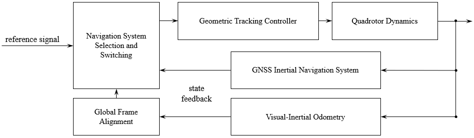
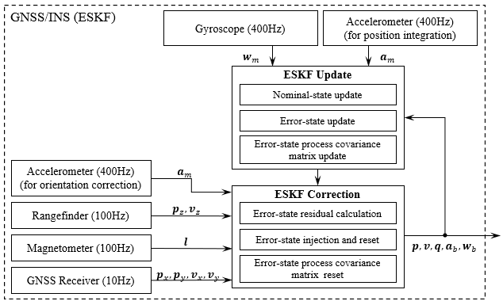
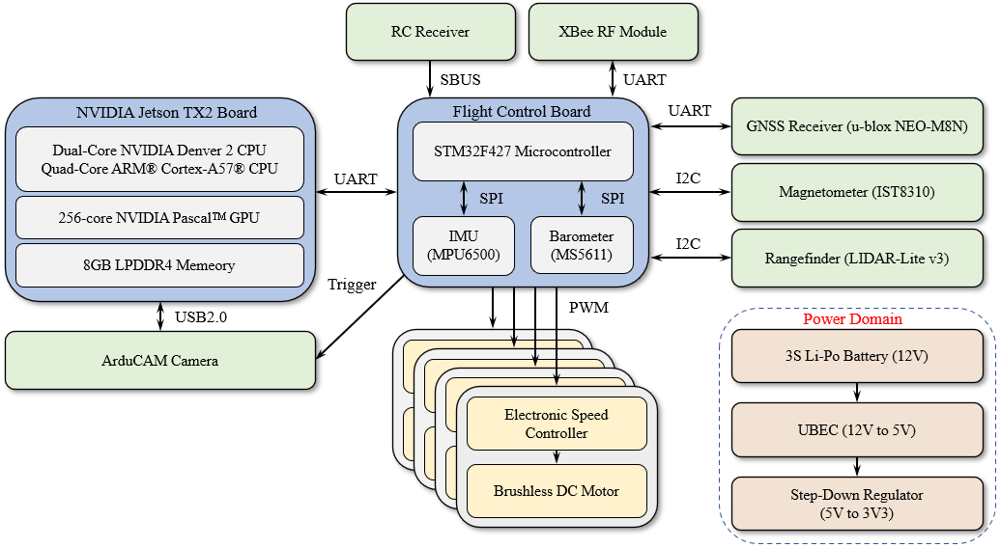
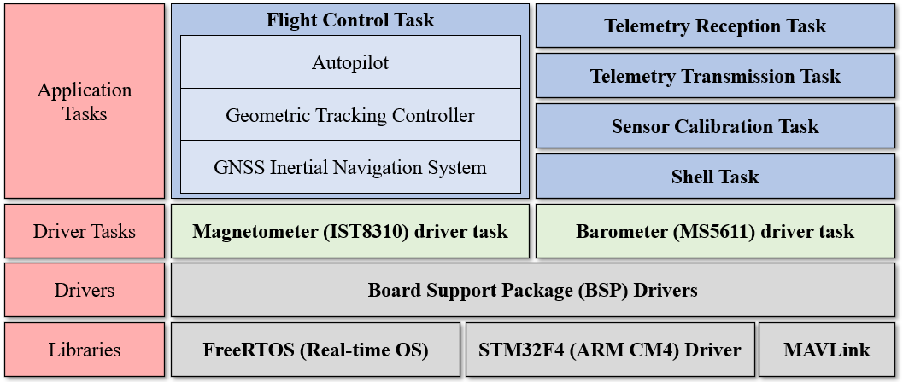

## Overview

This project addresses the challenge of reliable UAV navigation during transitions between outdoor and indoor environments, where GNSS signals are weak or unavailable. We developed a multirotor UAV system that combines GNSS/INS (using an Error-State Kalman Filter) with monocular Visual-Inertial Odometry (VIO) to enable continuous, uninterrupted navigation.

Key contributions:
* A nonlinear flight control system for multirotor UAVs
* GNSS/INS navigation with an Error-State Kalman Filter
* VIO integration for GNSS-denied environments
* A working prototype demonstrating real-time navigation switching

This work highlights a robust system integration approach for environment-adaptive navigation, allowing UAVs to operate seamlessly across GNSS-available and GNSS-denied settings.

<iframe src="https://www.youtube.com/embed/hBBe1Kj82B4" title="Presentation Video for Masters Thesis Defense" width="100%" height="500px" frameborder="0" allow="accelerometer; autoplay; clipboard-write; encrypted-media; gyroscope; picture-in-picture; web-share" referrerpolicy="strict-origin-when-cross-origin" allowfullscreen></iframe>

## Gallery

### Control System Diagram

### Error-state Kalman Filter

### Hardware Architecture

### Software Architecture

